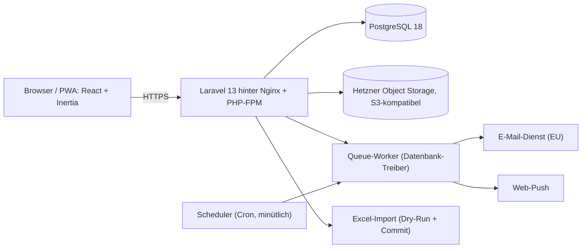
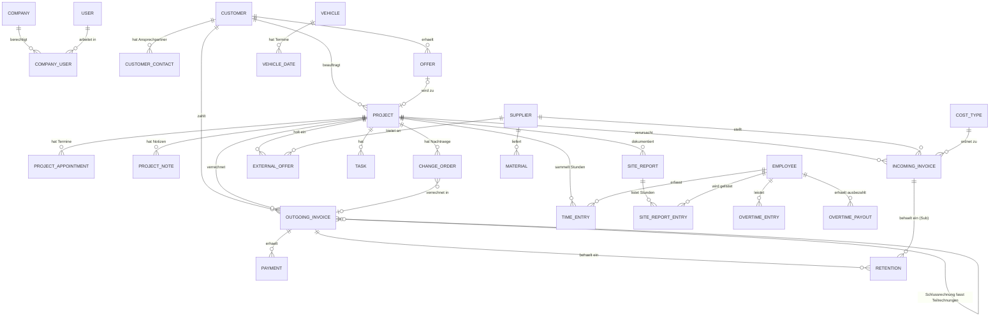

# BauPilot – Technisches Architekturblatt Version 1.1

Stand: 09.07.2026 · Status: Entwurf zur Abstimmung

Bezug: Spezifikation v1.2 (fachlich führend). Dieses Blatt legt Stack, Datenmodell, Kernmechanik, Betrieb und Baureihenfolge fest, damit Schritt 1A sauber programmiert werden kann und 1B architektonisch vorbereitet ist. Version 1.1 arbeitet die Ergebnisse der technischen Review ein; die Änderungen gegenüber Version 1.0 sind in Abschnitt 13 zusammengefasst.

---

## 1 Stack-Entscheidung

| Baustein | Wahl | Version (Stand Juli 2026) |
|---|---|---|
| Backend-Framework | Laravel | 13 (erschienen 17.03.2026) |
| Sprache | PHP | 8.5 (Minimum für Laravel 13 ist 8.3) |
| Frontend-Kopplung | Inertia.js mit React | Inertia 2, React 19 |
| Oberfläche | Tailwind CSS, Komponenten aus dem Prototyp | Tailwind 4 |
| Datenbank | PostgreSQL | 18 |
| Queue | Laravel Queue mit Datenbank-Treiber | – |
| Dateispeicher | S3-kompatibler Objektspeicher (Hetzner Object Storage) | – |
| E-Mail | Transaktionsdienst mit EU-Verarbeitung | offene Entscheidung (Abschnitt 12) |
| Push | Web-Push (VAPID) über die installierte PWA | – |
| Ausgangspunkt | Offizielles Laravel-React-Starter-Kit (Fortify-Auth, Inertia, Tailwind) | – |

Begründung: Laravel plus Inertia liefert genau das Profil dieses Projekts – eine Verwaltungsanwendung mit Formularen, Listen, Rechten und Hintergrundjobs, gebaut von einem kleinen Team. Frontend und Backend bleiben eine Codebasis mit einem Deployment; die React-Komponenten und das Design des Prototyps werden übernommen. Policies (Rechtekonzept), Eloquent Global Scopes (Mandantentrennung), Queues, Scheduler, Storage-Abstraktion und Mail sind Bordmittel des Frameworks statt Eigenbau. Die Alternative Node/NestJS plus separater React-SPA wurde verworfen: Sie erzwingt zwei Deployments, eine eigene API-Schicht für alles und doppelte Validierung, ohne bei dieser Projektgröße einen Vorteil zu bringen.

Eine bewusste Ergänzung zur reinen Inertia-Welt: Die Schreibzugriffe der Baustellen-Funktionen (Zeiten, Fotos, Notizen, Aufgaben-Erledigung, Regieberichte) werden von Anfang an zusätzlich als schlanke JSON-Endpunkte geführt (Abschnitt 9). Inertia bedient die Navigation; die JSON-Endpunkte sind die Andockstelle für den Offline-Puffer in 1B und für eine eventuelle spätere App.

## 2 Gesamtbild

Alles läuft auf einer einzigen Hetzner-Instanz (Abschnitt 10): Webserver, PHP, Datenbank, Queue-Worker und Scheduler. Der Objektspeicher ist der einzige externe Baustein neben E-Mail und Push. Diese Einfachheit ist Absicht – bei einigen tausend Belegen pro Jahr und einer Handvoll Benutzern ist jede weitere Komponente unnötige Betriebsarbeit.

## 3 Mandantentrennung und Rechte – technisch

Jede fachliche Tabelle trägt eine Spalte `company_id` (Fremdschlüssel auf `companies`, nicht null). Ein gemeinsamer Model-Trait `BelongsToCompany` setzt einen Eloquent Global Scope, der jede Abfrage automatisch auf die aktive Firma einschränkt, und befüllt `company_id` beim Anlegen. Die aktive Firma liegt in der Session und wird von einer Middleware (`SetActiveCompany`) je Request gesetzt; ein Wechsel ist nur auf Firmen möglich, für die ein Eintrag in `company_user` existiert. Die Schreib-Endpunkte unter `/api/…` verlassen sich nicht auf diesen impliziten Session-Zustand: Sie verlangen die Ziel-`company_id` im Request (serverseitig gegen `company_user` validiert), damit Offline-Replays, mehrere Browser-Tabs und Push-Deep-Links nie in der falschen Firma landen (Abschnitt 9).

Außerhalb eines HTTP-Requests gibt es keine Session – Queue-Jobs und Scheduler-Läufe erhalten ihren Mandantenkontext deshalb explizit: Jobs, die je Firma arbeiten (tägliche Zusammenfassung, Nummern-Lückenprüfung), iterieren selbst über die Firmen und setzen den Kontext programmatisch; alle übrigen Jobs (Bildverkleinerung, Push-Versand) bekommen die `company_id` in ihre Payload serialisiert. Der Global Scope wirft im Queue- und Konsolenkontext ohne explizit gesetzten Kontext eine Exception, statt still leer oder ungefiltert zu liefern. Die verpflichtenden Tenancy-Tests decken diese Fälle mit ab.

Die Rechte bildet `company_user` ab: `user_id`, `company_id`, `role` (Enum `admin | office | site`). Laravel-Policies je Modell prüfen die Rolle aus diesem Pivot – serverseitig, unabhängig davon, was die Oberfläche anzeigt. Die Finanz-Sichtbarkeit (Rolle `site` sieht keine Rechnungen, offenen Posten, Fremdangebote, Nachtragsbeträge, Projektzahlen) ist ein Gate, das sowohl Policies als auch die Inertia-Props filtert – Beträge, die die Rolle nicht sehen darf, verlassen den Server gar nicht erst.

Eindeutigkeiten gelten je Firma, nicht global: zusammengesetzte Unique-Constraints wie `(company_id, number)` auf Ausgangsrechnungen oder `(company_id, name)` auf Kostenarten. Datensätze zwischen Firmen verschieben kann nur ein `admin` über einen eigenen Service, der den Vorgang protokolliert. Als zweite Verteidigungslinie kann später PostgreSQL Row-Level-Security aktiviert werden; für 1A genügen Scope plus Policies plus Tests. Verpflichtend sind Feature-Tests, die für jedes Modell nachweisen, dass ein Benutzer der Firma A keinen Datensatz der Firma B lesen, ändern oder erraten kann (auch nicht per direkter ID in der URL).

Gleichzeitiges Arbeiten: Jede fachliche Tabelle trägt `lock_version` (Integer). Formulare senden die gelesene Version mit; stimmt sie beim Speichern nicht mehr, antwortet der Server mit Konflikt, und die Oberfläche zeigt den Vergleichsdialog aus der Spezifikation (Abschnitt 4 der Spec). `created_by` und `updated_by` liegen als Spalten auf allen fachlichen Tabellen.

## 4 Datenmodell

### 4.1 Namenskonventionen

Code, Tabellen und Spalten sind englisch (snake_case), die Oberfläche ist deutsch. Beträge sind `DECIMAL(12,2)` – niemals Float. Datumsfelder ohne Uhrzeit sind `DATE`; Zeitstempel `TIMESTAMPTZ`; die Anwendung rechnet in Europe/Vienna. Primärschlüssel sind BIGINT-Autoincrement; die in 1B offline erfassbaren Tabellen tragen zusätzlich `client_uuid` (unique je Firma) für Idempotenz. Belege werden nie gelöscht, nur storniert oder archiviert; Stammdaten (Kunden, Lieferanten, Mitarbeiter, Fahrzeuge) haben Soft-Deletes bzw. Aktiv-Kennzeichen.

Übersetzungstabelle der fachlichen Begriffe:

| Deutsch (Spec) | Englisch (Code) |
|---|---|
| Firma / Mandant | company |
| Kunde | customer |
| Lieferant | supplier |
| Angebot (an Kunden) | offer |
| Projekt | project |
| Ausgangsrechnung | outgoing_invoice |
| Eingangsrechnung | incoming_invoice |
| Einbehalt (Haft-/Deckungsrücklass) | retention |
| Nachtrag | change_order |
| Fremdangebot | external_offer |
| Regiebericht | site_report |
| Baustellen-Notiz | project_note |
| Aufgabe / Mangel | task (kind: task/defect) |
| Kostenart | cost_type |
| Pickerl-Termin | inspection_due_on |
| Überstunden | overtime_entry / overtime_payout |

### 4.2 Beziehungsübersicht

`company_id` liegt auf jeder fachlichen Tabelle und ist im Diagramm zur Lesbarkeit weggelassen. Ebenfalls weggelassen sind: die Dokument-Verknüpfung, die polymorph an Angeboten, Ausgangs- und Eingangsrechnungen, Projekten, Nachträgen, Fremdangeboten und Regieberichten hängt; alle Verweise auf `users` (`responsible_user_id`, `assignee_user_id`, `employees.user_id`, `created_by`/`updated_by`); und der Standard-Kostenart-Verweis `suppliers.default_cost_type_id`. Einbehalte hängen polymorph an Aus- und Eingangsrechnungen (Abschnitt 4.3).

### 4.3 Tabellenkatalog

Spalte „Schritt" kennzeichnet, wann die Tabelle produktiv gebraucht wird; alle Migrationen können trotzdem von Beginn an angelegt werden.

Kern und Zugriff:

| Tabelle | Zweck | Wichtige Felder | Schritt |
|---|---|---|---|
| companies | Mandanten | name, short_code, color, legal_form, address, vat_id, logo_path, fiscal_year_start_month (Standard 9), calc_hourly_rate, warranty_years (Standard 3), archived_at | 1A |
| users | Benutzerkonten | name, email, password, two_factor_secret | 1A |
| company_user | Rolle je Firma | company_id, user_id, role (admin/office/site) | 1A |
| notification_settings | Benachrichtigungswahl | user_id, company_id, daily_email, push | 1A |
| push_subscriptions | Web-Push-Abos | user_id, endpoint, public_key, auth_token | 1A |
| notification_log | Schutz vor Doppelversand | company_id, user_id, source_type, source_id, kind, sent_on | 1A |

Stammdaten:

| Tabelle | Zweck | Wichtige Felder | Schritt |
|---|---|---|---|
| customers | Kundenstamm | name, address, phone, email, vat_id, payment_target_days (Standard 14), external_ref, notes, deleted_at | 1A |
| customer_contacts | Ansprechpartner | customer_id, name, phone, email | 1A |
| suppliers | Lieferantenstamm | name, short_code, payment_target_days (Standard 30), default_cost_type_id, skonto_percent, skonto_days, notes | 1A |
| cost_types | Kostenarten je Firma | name, sort_order, active | 1A |
| employees | Mitarbeiter (auch ohne Login) | name, overtime_rate, calc_hourly_rate (nullable, übersteuert Firmenwert), user_id (nullable), active, notes | 1A |
| vehicles | Fuhrpark | plate, brand, model, inspection_due_on, vignette_until, fuel_card, active, notes | 1A |
| vehicle_dates | Weitere Fahrzeugtermine | vehicle_id, label, due_on | 1A |
| materials | Artikel-Preisliste | supplier_id, article_no, name, price_net, package_unit, notes | 1A |

Vertrieb und Projekte:

| Tabelle | Zweck | Wichtige Felder | Schritt |
|---|---|---|---|
| offers | Angebote an Kunden | customer_id, location, description, status, viewing_on, follow_up_on, offer_number, offer_amount_net, project_id (nullable, nach Annahme), notes | 1A |
| projects | Drehscheibe | customer_id, title, site_address, description, responsible_user_id, commissioned_on, started_on, planned_finish_on, finished_on, status, warranty_until, notes | 1A |
| project_appointments | Termine | project_id, on_date, label | 1A |
| project_notes | Baustellen-Notizen | project_id, body, created_by, client_uuid | 1B |
| change_orders | Nachträge | project_id, title, description, amount_net, status, outgoing_invoice_id (nullable), document via documents | 1A |
| external_offers | Fremdangebote | project_id, supplier_id, title, amount_net, received_on, valid_until, status, notes | 1A |
| tasks | Aufgaben und Mängel | project_id, kind (task/defect), title, description, due_on, assignee_user_id, done_at, client_uuid | 1B |
| site_reports | Regieberichte | project_id, number (je Firma fortlaufend), report_date, status (draft/signed), body_text, material_text, signature_path, signed_at, client_uuid | 1B |
| site_report_entries | Stunden je Bericht | site_report_id, employee_id, hours | 1B |

Belege und Geld:

| Tabelle | Zweck | Wichtige Felder | Schritt |
|---|---|---|---|
| outgoing_invoices | Ausgangsrechnungen | doc_type (invoice/partial/final/credit_note/cancellation), number, invoice_date, due_on (beim Anlegen aus dem Kunden-Zahlungsziel vorbefüllt, je Rechnung überschreibbar), customer_id, project_id (nullable), original_invoice_id (nullable, Pflicht bei Gutschrift/Storno), final_invoice_id (nullable, auf Teilrechnungen nach Schlussrechnungslegung), net, vat_rate, vat, gross, zero_rate_reason (Enum, nullable), payment_status, notes | 1A |
| payments | Zahlungseingänge | outgoing_invoice_id, paid_on, amount, retention_id (nullable; gesetzt = Freigabe genau dieses Einbehalts) | 1A |
| retentions | Einbehalte | retainable_type/id (polymorph: Ausgangs- oder Eingangsrechnung), kind (warranty/coverage), percent (nullable), amount, due_on, note, received_at (nullable) | 1A |
| incoming_invoices | Eingangsrechnungen | supplier_id, supplier_invoice_no, invoice_date, date_estimated (bool, Import), net, vat_rate, vat, gross, reverse_charge (bool), cost_type_id, project_id (nullable), payment_method (nullable), payment_due_on, skonto_amount, skonto_until, payment_status, paid_on, paid_amount (nullable, tatsächlich gezahlter Betrag – weicht bei gezogenem Skonto oder Teilzahlung von gross ab), checked (bool), subject, notes | 1A |
| time_entries | Projektstunden | employee_id, project_id, work_date, hours, activity, client_uuid | 1B |
| overtime_entries | Überstunden je Monat | employee_id, year, month, hours, note | 1A |
| overtime_payouts | Auszahlungen | employee_id, paid_on, hours, amount | 1A |

Querschnitt:

| Tabelle | Zweck | Wichtige Felder | Schritt |
|---|---|---|---|
| documents | Dateien, polymorph | documentable_type/id, category (offer/invoice/plan/photo/delivery_note/other), original_name, path, size, mime, created_by, client_uuid | 1A (Beleg-PDFs), 1B (voller Projektbereich) |
| import_runs | Import-Läufe | source_filename, status (dry_run/committed), stats (JSON), created_by | 1A |
| import_findings | Prüfbericht-Einträge | import_run_id, type (warning/duplicate/estimate), message, payload (JSON), decision | 1A |
| company_transfers | Protokoll für Verschiebungen | record_type, record_id, from_company_id, to_company_id, user_id | 1A |
| merge_logs | Protokoll für Dubletten-Zusammenführungen | record_type, kept_id, merged_id, user_id, payload (JSON) | 1A |

### 4.4 Enums

| Feld | Werte |
|---|---|
| company_user.role | admin, office, site |
| offers.status | inquiry, viewing_planned, offered, accepted, rejected, no_response |
| projects.status | open, active, done |
| outgoing_invoices.doc_type | invoice, partial, final, credit_note, cancellation |
| outgoing_invoices.payment_status | open, partial, paid, cancelled |
| outgoing_invoices.zero_rate_reason | reverse_charge_19_1a, intra_community, other |
| incoming_invoices.payment_status | open, partial, paid |
| retentions.kind | warranty (Haftrücklass), coverage (Deckungsrücklass) |
| change_orders.status | requested, offered, commissioned, invoiced, rejected |
| external_offers.status | received, commissioned, rejected |
| tasks.kind | task, defect |
| site_reports.status | draft, signed |
| documents.category | offer, invoice, plan, photo, delivery_note, other |

## 5 Fachliche Kernmechanik im Code

Offene Posten werden nicht gespeichert, sondern aus den Belegen berechnet – es gibt genau eine Quelle dafür, eine Query-Klasse `OpenItemsQuery`, die überall verwendet wird (Liste, Dashboard, Kundenkarte, Fristen). Je Rechnung gilt: jetzt fällig = gross minus Summe der Zahlungen minus Summe der Einbehalte, deren `due_on` in der Zukunft liegt und die noch nicht eingegangen sind; einbehalten = Summe dieser offenen Einbehalte. Gutschriften und Storni gehen mit negativem Betrag in dieselbe Rechnung ein.

Drei Konventionen machen diese Rechnung eindeutig. Erstens trägt eine Schlussrechnung nur den noch nicht verrechneten Restbetrag – Teilrechnungen bleiben eigenständige offene Posten und werden nach Schlussrechnungslegung über `final_invoice_id` der Schlussrechnung zugeordnet; die kumulierte Darstellung (Gesamtleistung abzüglich Teilrechnungen) ist reine Sache des Rechnungs-PDFs. Ohne diese Regel würde die Query offene Posten doppelt zählen. Zweitens werden net, vat und gross bei Gutschrift und Storno negativ gespeichert; die Query summiert also stumpf, ohne Sonderfälle. Drittens wird der Zahlstatus bei jeder saldowirksamen Buchung neu abgeleitet – Zahlung, Gutschrift oder Storno –, niemals von Hand gesetzt; eine vollständig stornierte Rechnung erhält den Status `cancelled` statt eines irreführenden `paid`. Die Freigabe eines Einbehalts ist eine Zahlung mit gesetzter `retention_id`; derselbe Service setzt in derselben Transaktion `received_at` am Einbehalt, damit die Query den Rücklass nie doppelt abzieht.

Fristen werden ebenfalls berechnet statt gespeichert: ein `DeadlineService` sammelt sie zur Laufzeit aus den Quelltabellen (Zahlungsziele – für Ausgangsrechnungen das gespeicherte `due_on`, damit eine spätere Änderung des Kunden-Zahlungsziels Bestandsrechnungen nicht rückwirkend verschiebt –, Skonto, Rücklässe, Aufgaben, Projekt- und Fahrzeugtermine, Gewährleistung, Wiedervorlagen) – dadurch kann eine Frist nie vom Datenstand abweichen, und „erledigen" heißt immer, die Ursache zu bearbeiten (Rechnung bezahlen, Aufgabe abhaken). Nur der Versand von Erinnerungen braucht Gedächtnis: `notification_log` hält fest, welche Frist welchem Benutzer an welchem Tag gemeldet wurde, damit nichts doppelt verschickt wird.

Beträge rechnet ein zentraler `MoneyHelper`: Eingabe wahlweise netto oder brutto, das Gegenstück und die USt aus dem Steuersatz, kaufmännisch auf zwei Nachkommastellen gerundet; bei `reverse_charge` ist der Satz 0 und die USt 0. Alle drei Werte (net, vat, gross) werden gespeichert, damit Auswertungen nicht nachrechnen müssen und Rundungen stabil bleiben.

Die Nummern-Lückenprüfung läuft als nächtlicher Job je Firma: Sie extrahiert den numerischen Teil der Ausgangsrechnungsnummern des laufenden Geschäftsjahres, prüft auf Duplikate (hart, bereits per Unique-Constraint verhindert) und auf Sprünge (weich, als Dashboard-Hinweis). Dublettenerkennung für Kunden und Lieferanten nutzt die PostgreSQL-Erweiterung `pg_trgm`: Namen werden normalisiert (Kleinschreibung, Umlaute aufgelöst, Leerzeichen bereinigt) und per Trigramm-Ähnlichkeit verglichen; ab einem Schwellwert entsteht ein Vorschlag, zusammengeführt wird ausschließlich nach Bestätigung durch einen `MergeService`, der alle Fremdschlüssel umhängt und den Vorgang in `merge_logs` protokolliert.

## 6 Dateiablage

Alle Dateien liegen privat im Objektspeicher, niemals öffentlich. Schlüsselschema: `{env}/{company_id}/{model}/{id}/{uuid}-{originalname}`. Der Download läuft ausschließlich über signierte, kurzlebige URLs (15 Minuten), die der Server erst nach Policy-Prüfung ausstellt. Uploads in 1A gehen durch den Server (einfach, auth-sicher, Belege sind klein); für die Fotos in 1B ist ein direkter, vorab signierter Upload in den Speicher vorgesehen, damit große Bilder nicht durch PHP laufen. Bilder werden nach dem Upload per Queue-Job auf maximal 2560 Pixel Kantenlänge verkleinert (Original bleibt optional erhalten), Obergrenze je Datei 25 MB. Der Objektspeicher ist Teil der Sicherungsstrategie (Abschnitt 10).

## 7 Benachrichtigungen und Hintergrundjobs

Der Laravel-Scheduler läuft als Cron-Eintrag minütlich; ein Queue-Worker (Datenbank-Treiber) läuft als systemd-Dienst mit automatischem Neustart. Redis ist bei diesem Volumen unnötig und kann später ohne Codeänderung nachgerüstet werden (nur Treiberwechsel).

Feste Jobs: die tägliche Zusammenfassung um 06:00 Europe/Vienna (je Benutzer und Firma, nur wenn laut `DeadlineService` etwas ansteht, dedupliziert über `notification_log`), Push-Benachrichtigungen über das WebPush-Paket (VAPID-Schlüsselpaar je Umgebung), die Nummern-Lückenprüfung, die Bildverkleinerung und der Versand von Aufgaben-Erinnerungen an Zuständige. Den Mandantenkontext beziehen alle Jobs explizit nach Abschnitt 3 (Iteration über die Firmen bzw. `company_id` in der Job-Payload). E-Mails laufen über einen Transaktionsdienst mit EU-Verarbeitung (Abschnitt 12); Absender-Domain mit SPF/DKIM.

Einordnung von Web-Push in den EU-Anspruch: Die Auslieferung läuft technisch zwingend über die Push-Dienste der Browserhersteller (Google, Apple, Mozilla), also über Drittanbieter außerhalb der EU – daran führt bei Web-Push kein Weg vorbei. Die Payload ist nach RFC 8291 Ende-zu-Ende verschlüsselt und enthält nur den Minimalinhalt (Titel, Kurztext, Ziel-Link, keine Beträge); der Drittlandtransfer der Push-Metadaten (wer erhält wann Nachrichten) wird im Verarbeitungsverzeichnis und in der Datenschutzinformation ausgewiesen. Ein Push-Deep-Link trägt die Ziel-Firma; `SetActiveCompany` schaltet beim Öffnen darauf um, damit der Global Scope den Zieldatensatz nicht versteckt.

## 8 Excel-Import als eigener Ablauf

Der Import ist ein zweiphasiger, geführter Ablauf, kein einmaliges Skript. Phase 1 (Dry-Run) liest die Datei mit PhpSpreadsheet, wendet das erprobte Mapping aus der Prototyp-Analyse an (Blätter, Spalten, Monatsblöcke, Geschäftsjahre, „Diverse"-Einträge; die §19-Spalte wird auf den strukturierten Wert `zero_rate_reason = reverse_charge_19_1a` gemappt, damit die §19-Summen aus M5 sauber aggregierbar sind) und schreibt nichts Fachliches – sie erzeugt einen `import_run` mit Statistik (Anzahl und Summen je Bereich, Soll/Ist-Vergleich zu den Excel-Summen) und `import_findings` für alles, was Bestätigung braucht: Kunden- und Lieferanten-Dubletten, geschätzte Datumsangaben (Monatsmitte), vorgeschlagene Pickerl-Daten, unplausible Termine wie die Rechnung 250184. Phase 2 (Commit) schreibt transaktional je Bereich, nachdem der Benutzer die Findings entschieden hat. Jeder importierte Datensatz trägt eine `source_ref` (Blatt, Zeile bzw. Blockposition), wodurch ein erneuter Lauf derselben Datei idempotent ist und nichts doppelt anlegt. Derselbe Ablauf dient später der Einzelfirma und weiteren Mandanten mit deren Dateien.

## 9 Vorbereitung des Offline-Puffers (1B)

Damit der Erfassungspuffer in 1B kein Umbau wird, gilt ab 1A: Die Schreiboperationen der Baustellen-Funktionen (Zeiten, Aufgaben-Erledigung, Notizen auf `project_notes`, Foto-Upload, Regieberichte) existieren als JSON-Endpunkte unter `/api/…`, authentifiziert über dieselbe Session (Sanctum-Cookie-Modus), autorisiert über dieselben Policies. Jeder Schreib-Request trägt die Ziel-`company_id` explizit (Abschnitt 3) und wird beim Erfassen mitsamt Firma in die Warteschlange geschrieben – ein zwischenzeitlicher Firmenwechsel in Session oder Zweit-Tab kann einen gepufferten Request damit nicht in die falsche Firma verbuchen.

Idempotenz: Jede anlegende Operation (Zeiten, Notizen, Regieberichte, Foto-Upload auf `documents`) verlangt eine vom Client erzeugte `client_uuid`; der Server behandelt Wiederholungen mit derselben Kombination `(company_id, client_uuid)` als bereits erledigt. Update-Operationen wie die Aufgaben-Erledigung sind von Natur aus zustands-idempotent – `done_at` wiederholt zu setzen ändert nichts – und brauchen keine eigene UUID-Buchführung.

In 1B kommt clientseitig ein Service-Worker mit einer IndexedDB-Warteschlange dazu, der fehlgeschlagene Requests sichtbar sammelt und bei Verbindung erneut sendet – serverseitig ändert sich dann nichts mehr. Das Replay-Protokoll ist dafür schon jetzt festgelegt, weil der Sanctum-Cookie-Modus zwei Stolpersteine hat: Vor dem Abarbeiten der Warteschlange holt der Client ein frisches CSRF-Token (`/sanctum/csrf-cookie`), damit gepufferte Requests nicht mit 419 scheitern; Antworten mit 401 oder 419 gelten nicht als endgültiger Fehler, sondern halten die Warteschlange, stoßen die erneute Anmeldung an und senden danach weiter. Die Session-Lebensdauer der PWA wird bewusst großzügig gesetzt (Remember-Token), damit ein Nachmittag im Funkloch nicht an einer abgelaufenen Session scheitert – genau das ist das Abnahmekriterium von M9. Ein vollständiges Offline-Lesen aller Daten bleibt bewusst außerhalb von Version 1.

## 10 Deployment und Betrieb

Umgebung: eine Hetzner-Cloud-Instanz (Start: CPX31, 4 vCPU / 8 GB, jederzeit vergrößerbar) mit Ubuntu 24.04 LTS in einem EU-Rechenzentrum (Falkenstein oder Nürnberg). Darauf Nginx, PHP-FPM 8.5, PostgreSQL 18 und die Laravel-Prozesse (Web, Worker, Scheduler). Dazu ein Hetzner Object Storage Bucket je Umgebung. Zwei Umgebungen: `staging.baupilot.…` (eigene Datenbank, eigener Bucket, dort läuft auch der Echtdaten-Probeimport) und Produktion. TLS über Let's Encrypt, HTTP strikt auf HTTPS umgeleitet; die Domain ist festzulegen (Abschnitt 12).

Deployment über Laravel Forge oder Ploi (Abschnitt 12): Git-Push löst ein Zero-Downtime-Deploy aus (Composer, npm build, Migrationen, Cache, Worker-Neustart). CI vor dem Merge: Pint (Format), PHPStan (Statik), Pest (Tests) über GitHub Actions.

Sicherung: nächtlicher `pg_dump`, asymmetrisch verschlüsselt (age oder GPG: nur der öffentliche Schlüssel liegt am Server, der private wird offline beim Betreiber verwahrt – sonst wäre der Backup-Schlüssel beim Totalverlust des Servers mit verloren), in einen eigenen Backup-Bucket mit Write-only-Zugangsdaten ohne Löschrecht: Ein kompromittierter Server kann die Sicherungen damit weder lesen noch löschen. 30 Tage Aufbewahrung; zusätzlich wöchentlicher Server-Snapshot. Der Anwendungs-Bucket (Belege, Fotos, unterschriebene Regieberichte) ist mit Bucket-Versionierung gegen versehentliches und böswilliges Löschen geschützt – der Server-Snapshot erfasst ihn nicht, die Dateien brauchen ihre eigene Absicherung. Das nächtliche Backup bedeutet ein Datenverlust-Fenster (RPO) von bis zu 24 Stunden; das ist für 1A bewusst akzeptiert und kann bei Bedarf durch WAL-Archiving in den Objektspeicher verkürzt werden. Einmal pro Monat wird eine Sicherung testweise auf Staging eingespielt und dabei auch der Dokumentenzugriff stichprobenartig geprüft – eine Sicherung, die nie zurückgespielt wurde, ist keine.

Betriebsüberwachung: externer Uptime-Check auf einen Health-Endpunkt, der neben der Erreichbarkeit auch Plattenfüllstand, Queue-Rückstau (Alter des ältesten wartenden Jobs) und den Zeitstempel des letzten Scheduler-Laufs meldet – ein hängender Worker oder ausgefallener Cron fällt sonst erst auf, wenn der Digest ausbleibt. Der Backup-Job bestätigt jeden erfolgreichen Upload an einen Healthcheck-Dienst (Dead-Man-Switch: bleibt der Ping aus, gibt es Alarm, statt dass ein still fehlschlagender Dump erst beim monatlichen Restore-Test auffällt). Dazu Fehler-Tracking mit EU-Datenhaltung (Vorschlag Sentry, EU-Region) und Log-Rotation am Server. Secrets ausschließlich in `.env` bzw. im Deploy-Tool, nie im Repository.

## 11 Baureihenfolge

Die Reihenfolge folgt dem Vorschlag aus der Prüfung; je Meilenstein ist definiert, wann er fertig ist. Zeitschätzungen legen wir bewusst erst nach M1 fest, wenn die tatsächliche Geschwindigkeit sichtbar ist.

| Nr. | Meilenstein | Inhalt | Fertig, wenn |
|---|---|---|---|
| M1 | Grundsystem | Repo, CI, Starter-Kit, Login mit optionalem zweiten Faktor, Firmen anlegen, Rollen, Mandanten-Middleware und -Scope, Firmen-Plakette mit Kennfarbe und Wechsel | Tenancy- und Policy-Tests grün: kein Zugriff über Firmengrenzen, auch nicht aus Queue-Jobs und Scheduler; Rolle `site` erhält keine Finanzdaten |
| M2 | Stammdaten | Kunden mit Ansprechpartnern, Lieferanten, Kostenarten, Mitarbeiter, Fahrzeuge mit Zusatzterminen, Material; Dubletten-Vorschlag bei Anlage | Alle Stammdaten je Firma anleg-, such- und archivierbar; Dubletten-Vorschlag greift nachweislich |
| M3 | Kerngeschäft | Projekte mit Terminen, Nachträgen, Fremdangeboten und Belege-Bereich; Angebote mit Statuslauf und Übernahme ins Projekt; Ausgangsrechnungen mit Belegarten, Einbehalten, Zahlungen und PDF-Anhang; Eingangsrechnungen vollständig mit Beleg-Anhang | Ein Projekt lässt sich vom Angebot bis zur bezahlten Schlussrechnung samt Rücklass durchspielen; `MoneyHelper`- und `OpenItemsQuery`-Tests decken Teil-/Schlussrechnung, Gutschrift, Storno und Einbehalte ab |
| M4 | Auswertung und Fristen | Offene Posten (fällig/einbehalten), `DeadlineService` mit allen Quellen, Fristen-Ansicht, Dashboard, Mahn-Hinweise, Nummern-Lückenprüfung, tägliche E-Mail und Push; Überstunden-Erfassung je Monat und Auszahlungen | Fristen-Testfälle aus der Spec (angenommenes Zahlungsziel, Skonto, Rücklass, Pickerl-Vorwarnung, Gewährleistung) rechnen korrekt; Digest kommt genau einmal; Überstundensaldo je Mitarbeiter stimmt gegen Kontrollwerte |
| M5 | Excel-Import | Dry-Run mit Prüfbericht, Findings-Entscheidung, Commit, Idempotenz | Import der echten Übersicht_GmbH.xlsx auf Staging stimmt mit den bekannten Kontrollwerten überein (36 offene Rechnungen, ~179.238 € brutto offen, GJ-Summen, §19-Summen) |
| M6 | Go-Live 1A | Produktionsumgebung, Domain, Sicherungen aktiv, Benutzer eingeladen, Echtimport GmbH und Einzelfirma, kurze Einschulung | Das Büro arbeitet produktiv in BauPilot; die Excel wird eingefroren |
| M7 | 1B: Dokumente und Aufgaben | Voller Dokumente- und Fotobereich am Projekt (Kamera, Kategorien, direkter Upload), Aufgaben und Mängel mit Erinnerungen | Fotos vom Handy landen in Sekunden am richtigen Projekt |
| M8 | 1B: Zeiten und Projektzahlen | Zeiterfassung je Projekt (Schnellerfassung mobil), Projektzahlen mit Deckungsbeitrag | Projektzahlen stimmen gegen manuell gerechnete Kontrollprojekte |
| M9 | 1B: Regieberichte und Offline | Regieberichte mit Nummernkreis, Unterschrift und Sperre; Service-Worker-Warteschlange auf den JSON-Endpunkten | Ein Regiebericht wird im Funkloch erfasst, unterschrieben und synchronisiert nach |

## 12 Offene technische Entscheidungen

| Nr. | Frage | Vorschlag |
|---|---|---|
| 1 | E-Mail-Dienst mit EU-Verarbeitung | Brevo oder Mailjet (beide EU); Entscheidung nach kurzem Preis-/Zustellbarkeitsvergleich in M1 |
| 2 | Deploy-Werkzeug | Laravel Forge (offiziell, ausgereift) oder Ploi (günstiger, EU-Firma); beide passend |
| 3 | Fehler-Tracking | Sentry mit EU-Datenhaltung aktivieren: ja |
| 4 | PHP-Version | 8.5; falls ein benötigtes Paket klemmt, 8.4 als Rückfallebene |
| 5 | Domain | Festzulegen (z. B. baupilot.at oder Subdomain der Firmen-Domain); Staging als Subdomain |
| 6 | Objektspeicher | Hetzner Object Storage; Alternative nur, falls Regieberichts-Unterschriften besondere Anforderungen ergeben |
| 7 | Redis | Erst bei spürbarem Queue-Volumen; Wechsel ist reine Konfiguration |
| 8 | Einbehalte gegenüber Subunternehmern (auf Eingangsrechnungen) | Das Datenmodell kann sie ab sofort (`retentions` hängt polymorph auch an Eingangsrechnungen); ob 1A dafür Oberfläche bekommt, ist gegen die Spec zu klären – Vorschlag: Modell ja, Oberfläche erst bei Bedarf |

## 13 Änderungen gegenüber Version 1.0

Version 1.1 arbeitet die bestätigten Ergebnisse der technischen Review (drei Prüf-Perspektiven plus Faktencheck, alle Funde adversarial gegengeprüft) ein. Der Faktencheck bestätigte sämtliche Versions- und Produktangaben aus Abschnitt 1; inhaltlich wurde geändert:

**Mandantentrennung und Kontext (Abschnitte 3, 7, 9):** Queue-Jobs und Scheduler erhalten ihren Mandantenkontext jetzt explizit definiert (Iteration über Firmen bzw. `company_id` in der Job-Payload; Global Scope wirft ohne Kontext eine Exception); die Tenancy-Tests in M1 decken das mit ab. Die `/api`-Schreibendpunkte verlangen die Ziel-`company_id` explizit im Request statt implizit aus der Session – gegen falsche Verbuchung bei Offline-Replay, Zweit-Tab und Push-Deep-Link.

**Belege und Geld (Abschnitte 4, 5):** Schlussrechnungen tragen per Konvention nur den Restbetrag; Teilrechnungen werden über das neue `final_invoice_id` zugeordnet (verhindert Doppelzählung in der `OpenItemsQuery`). Gutschrift/Storno werden negativ gespeichert; der Zahlstatus wird bei jeder saldowirksamen Buchung abgeleitet, und `payment_status` kennt jetzt `cancelled`. `payments.retention_id` ersetzt das Bool `is_retention_release` und verknüpft die Freigabe mit genau einem Einbehalt. `retentions` hängt polymorph an Aus- und Eingangsrechnungen (Subunternehmer-Rücklässe, siehe offene Entscheidung 8). `outgoing_invoices` erhält ein gespeichertes `due_on`; `zero_rate_reason` ist jetzt ein Enum (§19-Summen aggregierbar, Import mappt darauf). `incoming_invoices` erhält `paid_amount` und den Status `partial`.

**Datenmodell-Vollständigkeit (Abschnitt 4):** Neue Tabellen `project_notes` (Ziel des Notizen-Endpunkts) und `merge_logs` (Protokoll des `MergeService`); `documents` trägt `client_uuid` (Idempotenz des Foto-Uploads); das ER-Diagramm zeigt jetzt alle Kindtabellen und Beleg-Beziehungen, die verbleibenden Auslassungen sind vollständig benannt; die polymorphen Dokument-Ziele umfassen auch Nachträge, Fremdangebote und Eingangsrechnungen.

**Offline-Puffer (Abschnitt 9):** Idempotenz präzisiert (Anlegen über `(company_id, client_uuid)`, Updates wie Aufgaben-Erledigung zustands-idempotent); Replay-Protokoll für den Sanctum-Cookie-Modus festgelegt (frisches CSRF-Token vor dem Abarbeiten, 401/419 halten die Queue statt sie zu verwerfen, großzügige Session-Lebensdauer der PWA).

**Betrieb (Abschnitte 7, 10):** Backups asymmetrisch verschlüsselt mit offline verwahrtem privatem Schlüssel, eigener Backup-Bucket mit Write-only-Zugang ohne Löschrecht; Anwendungs-Bucket mit Versionierung gesichert (die Dateien hatten bisher keine eigene Sicherung); RPO von 24 Stunden explizit benannt; Health-Endpunkt um Platte, Queue-Rückstau und Scheduler-Heartbeat erweitert, Dead-Man-Switch für den Backup-Job; Drittlandaspekt von Web-Push (Google/Apple/Mozilla) benannt und mit Payload-Minimierung plus RFC-8291-Verschlüsselung eingeordnet.

**Baureihenfolge (Abschnitt 11):** Überstunden-Erfassung und -Auszahlungen sind M4 zugeordnet (waren als 1A gekennzeichnet, aber keinem Meilenstein zugewiesen); M1-Kriterium um Tenancy im Queue-/Scheduler-Kontext erweitert.
